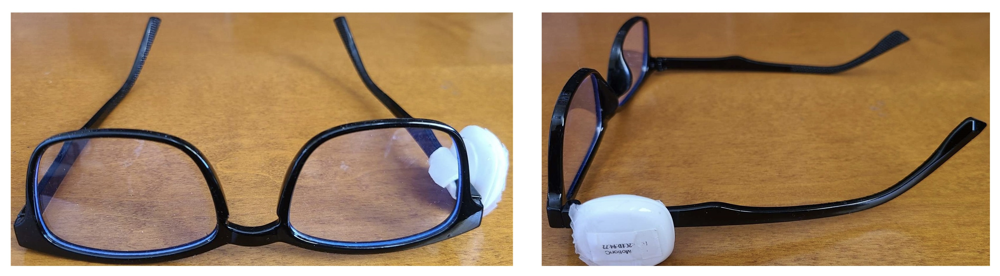

# ClassyGlass Dataset

The **ClassyGlass Dataset** contains multimodal time-series data collected from wearable smart glasses used by real participants. The dataset includes measurements from multiple onboard sensors, including an accelerometer, gyroscope, magnetometer, and pressure sensor. The data are organized by subject and recording session to support reproducible research and machine learning workflows.

## Index

- [Overview](#overview)
- [Motivation and Research Use](#motivation-and-research-use)
- [Dataset Contents](#dataset-contents)
- [Directory Structure](#directory-structure)
- [File Format](#file-format)
- [Sensor Specifications](#sensor-specifications)
- [Usage Notes](#usage-notes)
- [License and Citation](#license-and-citation)

---

## Overview

ClassyGlass is a comprehensive wearable sensing dataset designed for activity recognition and behavioral analysis research. It provides temporally aligned sensor streams recorded during controlled and semi-naturalistic sessions.

<p align="center">
   <br>
  <em>The ClassyGlass hardware setup with MetaMotionC sensor attached to the right temple.</em>
</p>

## Motivation and Research Use

The ClassyGlass Dataset was collected to support research in wearable computing, human activity recognition, and multimodal sensor fusion using head-mounted devices. Unlike wrist or phone-based datasets, this dataset captures motion and environmental signals from smart glasses, enabling analysis of head dynamics, fine-grained user behavior.

The dataset is suitable for tasks such as:

- Activity and gesture recognition
- Time-series classification and segmentation
- Multimodal sensor fusion
- Representation learning on wearable sensor data

---

## Dataset Contents

- **Multimodal sensor data:**
  - Accelerometer (100 Hz)
  - Gyroscope (100 Hz)
  - Magnetometer (20 Hz)
  - Pressure sensor (7.33 Hz)
- **Per-session CSV files** with columns (epoch, time, elapsed, x-axis, y-axis, z-axis)
- **Metadata** describing participants and recording sessions

---

## Directory Structure

Each dataset contains its own data description sheet. Follow that for dataset specific information

```
ClassyGlass/
├── Datasets/
│   ├── Dataset_1A (12 users with 11 activities each)
│   │   ├── Data description sheet.pdf
│   │   └── UserX
│   │       └── *.csv
│   ├── Dataset_1B (15 users with 15 activities each)
│   │   ├── Data description sheet.pdf
│   │   └── UserX
│   │       └── *.csv
│   └── Dataset_2 (35 users with 6 activities each)
│       ├── Data description sheet.pdf
│       └── UserX
│           └── *.csv
└── README.md

```

### Metadata directory: (Data collection procedure) <br>

**ClassyGlass/**

- **Datasets/**
  - **[Dataset_1A](Datasets/Dataset_1A/)** (12 users with 11 activities each)
    - [Data Description 1A](Datasets/Dataset_1A/Data%20description%20sheet%201A.pdf)
  - **[Dataset_1B](Datasets/Dataset_1B/)** (15 users with 15 activities each)
    - [Data Description 1B](Datasets/Dataset_1B/Data%20description%20sheet%201B.pdf)
  - **[Dataset_2](Datasets/Dataset_2/)** (35 users with 6 activities each)
    - [Data Description 2](Datasets/Dataset_2/Data%20description%20sheet%20Updated.pdf)

---

## File Format

**File name:** Each data file follows a structured naming convention that encodes metadata about
the device, recording time, sensor type, and sampling configuration. <br> `<experiment_id>_<device>_<timestamp>_<device_id>_<sensor_type>_<sampling rate>Hz_<firmware_version>.csv`

**Columns include:**

- `timestamp` — Time of measurement (ISO 8601 or Unix epoch in milliseconds)
- `elapsed` - Time relative to starting time
- `x-axis`, `y-axis`, `z-axis` — 6-axis Accelerometer sensore, Linear acceleration (m/s²)
- `x-axis`, `y-axis`, `z-axis` — 6-axis Gyroscope sensore, Angular velocity (deg/s)
- `x-axis`, `y-axis`, `z-axis` — 3-axis Magnetometer sensore, Magnetic field strength (T)
- `pressure` — Barometer/Pressure/Altimeter, Atmospheric pressure (hPa)
<br>
<br>
<p align="center">
   <br>
  <em>Visualization of different sensores timeseries data</em>
</p>

---

## Sensor Specifications

### Wearable IMU Sensor

Data were collected using the **MetaMotionC** wearable Inertial Measurement Unit (IMU) sensor [Sensore Link](https://mbientlab.com/store/metamotionc/). The device provides real-time and continuous motion and environmental sensing through an integrated 9-axis IMU and a pressure sensor. Data are transmitted via Bluetooth Low Energy (BLE) using an open-source API. Onboard Kalman filter–based sensor fusion is applied to improve signal quality and reduce noise. All sensor data are timestamped to enable precise synchronization across data streams.

#### Sensor Specifications

| Sensor                       | Measurement Range                  | Resolution | Sampling Rate                             |
| ---------------------------- | ---------------------------------- | ---------- | ----------------------------------------- |
| Accelerometer                | ±2, ±4, ±8, ±16 g                  | 16-bit     | 0.001–100 Hz (stream), up to 800 Hz (log) |
| Gyroscope                    | ±125, ±250, ±500, ±1000, ±2000 °/s | 16-bit     | 0.001–100 Hz (stream), up to 800 Hz (log) |
| Magnetometer                 | ±1300 µT (x,y), ±2500 µT (z)       | 0.3 µT     | 0.001–25 Hz                               |
| Barometer/Pressure/Altimeter | 300–1100 hPa                       | 0.01 hPa   | 0.001–50 Hz                               |

---

## Usage Notes

- Example usage in Python for experiment matching:

```python
from pathlib import Path
import pandas as pd

file_path = "Datasets/Dataset_1A/User1/1_MetaWear_2019-09-14T13.41.43.335_F1E55E2FE95F_Accelerometer_100.000Hz_1.4.5.csv"

# Load CSV
df = pd.read_csv(file_path)

# Extract filename
filename = Path(file_path).name

# Parse first number before underscore
raw_exp_num = int(filename.split("_")[0])

# Mod with 11 (map 1 -> 11)
experiment_number = raw_exp_num % 11 or 11

if experiment_number == 1:
    experiment = "Reading a book"

print("Raw experiment number:", experiment_number)
print("Mapped experiment:", experiment)
```

---

## License

- 🧑‍💻 The **code** in this repository is licensed under the [MIT License](./LICENSE).
- 📊 The **datasets** in the `data/` directory are released under the [CC BY 4.0 License](./LICENSE-CC-BY-4.0.txt).
