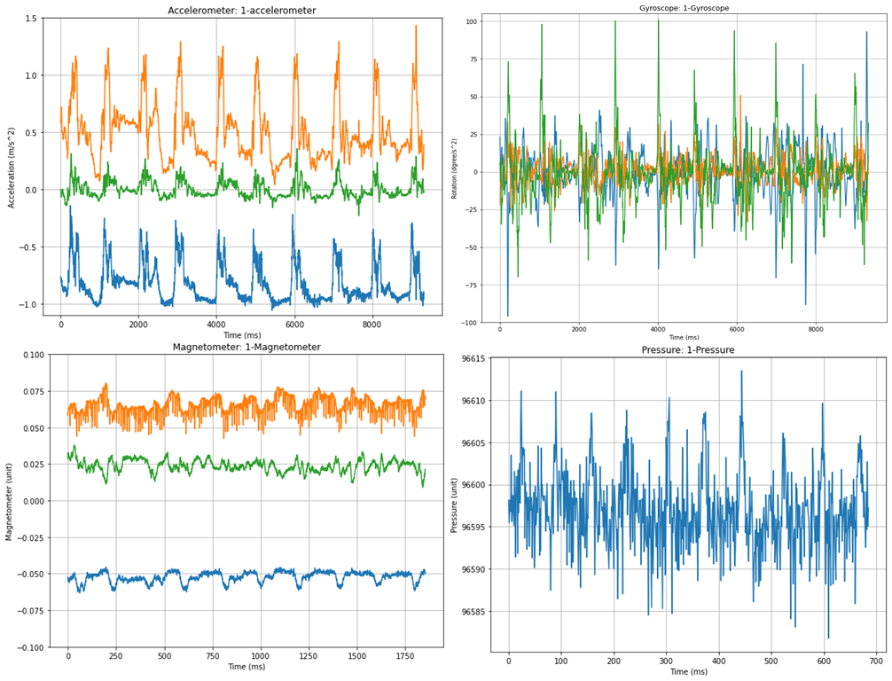
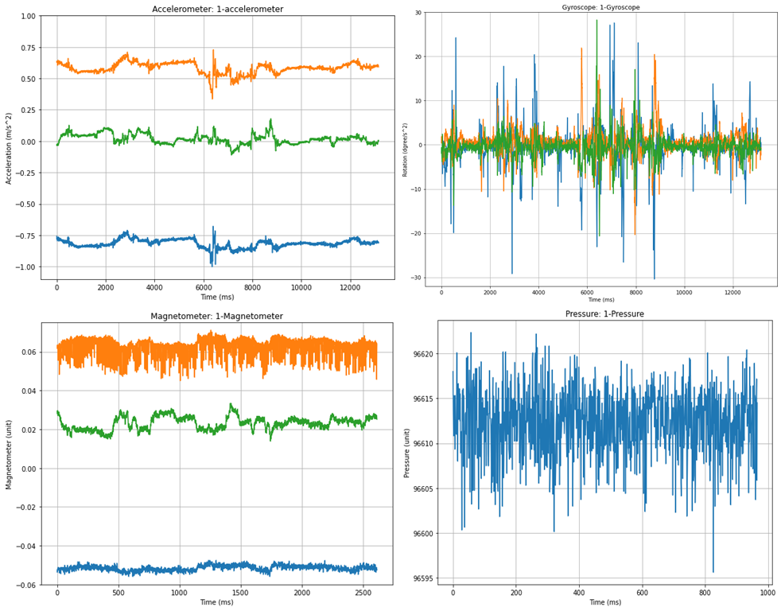
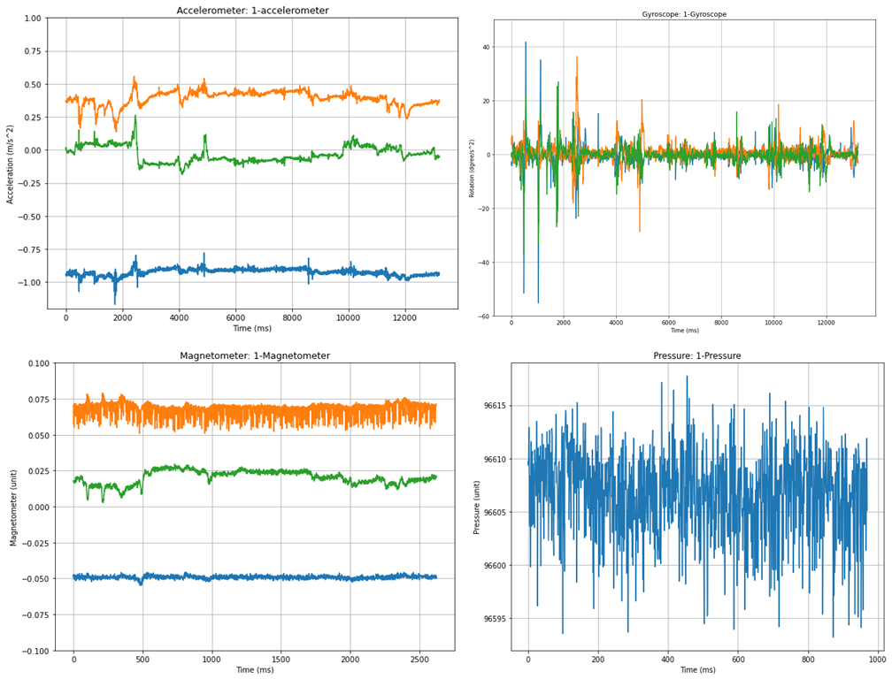
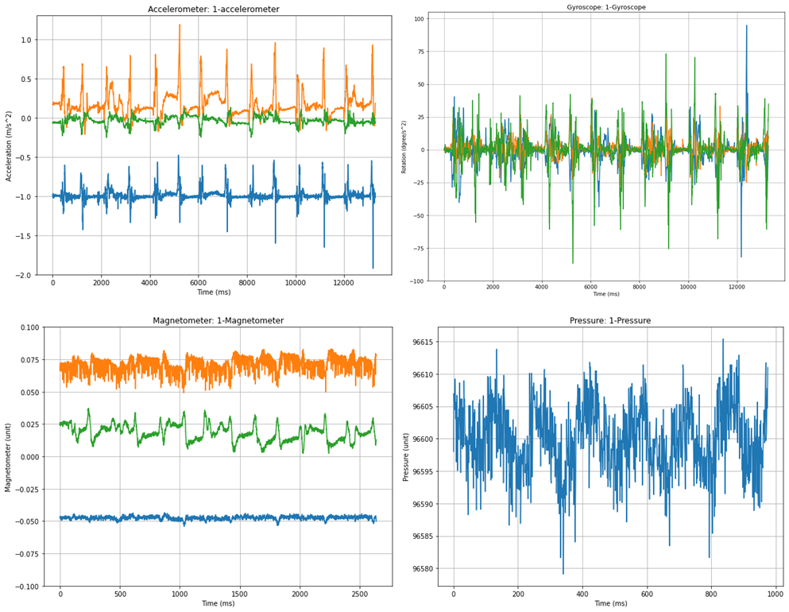
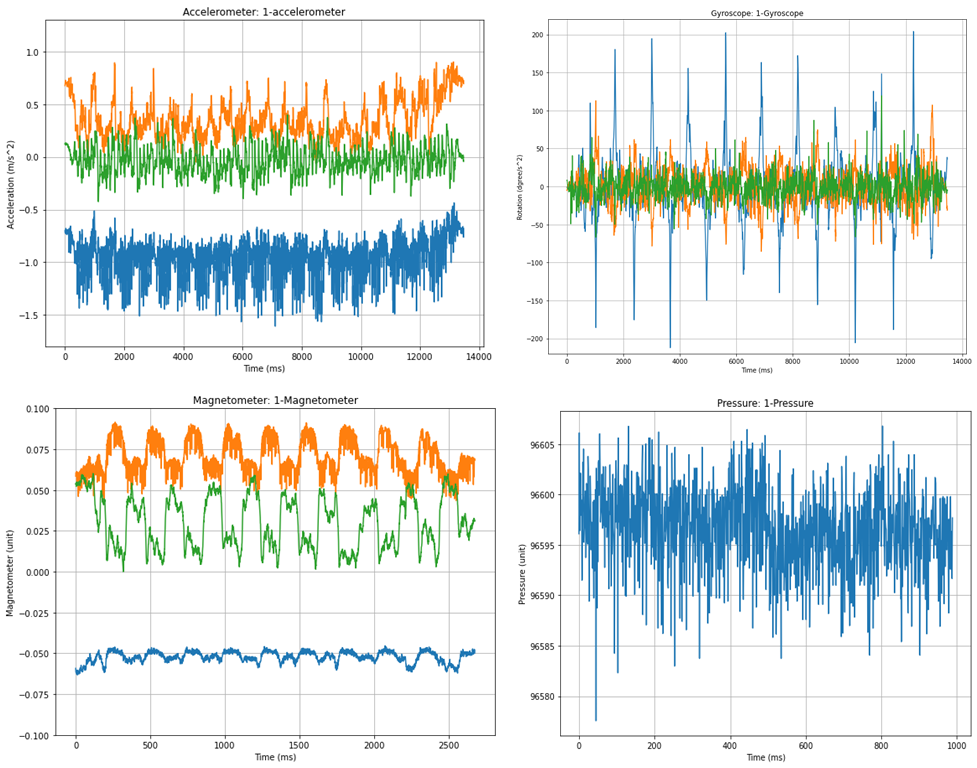
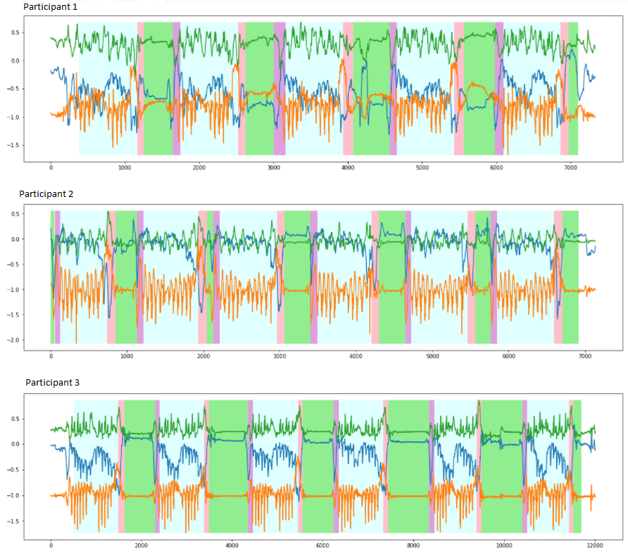

# ClassyGlass Dataset

The **ClassyGlass Dataset** contains multimodal time-series data collected from wearable smart glasses used by real participants. The dataset includes measurements from multiple onboard sensors, including an accelerometer, gyroscope, magnetometer, and pressure sensor. The data are organized by subject and recording session to support reproducible research and machine learning workflows.

## Index

- [Overview](#overview)
  - [Wearable IMU Sensor](#wearable-imu-sensor)
  - [Sensor Specifications](#sensor-specifications)
- [Directory Structure](#directory-structure)
- [Dataset Contents](#dataset-contents)
- [File Format](#file-format)
  - [Dataset Summary](#dataset-summary)
  - [Activity Summary](#activity-summary)
  - [Visualization of different activities](#visualization-of-different-activities)
- [Usage Notes](#usage-notes)
- [License](#license)

## Overview

ClassyGlass is a comprehensive wearable sensing dataset designed for activity recognition and behavioral analysis research. It provides temporally aligned sensor streams recorded during controlled and semi-naturalistic sessions.

<p align="center">
   <br>
  <strong>Figure 1:</strong>  <em>The ClassyGlass hardware setup with MetaMotionC sensor attached to the right temple.</em>
</p>

### Wearable IMU Sensor

Data were collected using the **MetaMotionC** wearable Inertial Measurement Unit (IMU) sensor [Sensore Link](https://mbientlab.com/store/metamotionc/). The device provides real-time and continuous motion and environmental sensing through an integrated 9-axis IMU and a pressure sensor. Data are transmitted via Bluetooth Low Energy (BLE) using an open-source API. Onboard Kalman filter–based sensor fusion is applied to improve signal quality and reduce noise. All sensor data are timestamped to enable precise synchronization across data streams.

<p align="center">
   <br>
  <strong>Figure 2:</strong> <em>The ClassyGlass hardware setup, showing the internal view of the MetaMotionC 10-axis IMU.</em> 
</p>

### Sensor Specifications

| Sensor                       | Measurement Range                  | Resolution | Sampling Rate                             |
| ---------------------------- | ---------------------------------- | ---------- | ----------------------------------------- |
| Accelerometer                | ±2, ±4, ±8, ±16 g                  | 16-bit     | 0.001–100 Hz (stream), up to 800 Hz (log) |
| Gyroscope                    | ±125, ±250, ±500, ±1000, ±2000 °/s | 16-bit     | 0.001–100 Hz (stream), up to 800 Hz (log) |
| Magnetometer                 | ±1300 µT (x,y), ±2500 µT (z)       | 0.3 µT     | 0.001–25 Hz                               |
| Barometer/Pressure/Altimeter | 300–1100 hPa                       | 0.01 hPa   | 0.001–50 Hz                               |

## Directory Structure

Each dataset contains its own data description sheet. Follow that for dataset specific information

**ClassyGlass/**

- **Datasets/**
  - **[Dataset_1A](Datasets/Dataset_1A/)** (12 users with 11 activities each)
    - [Data description 1A](Datasets/Dataset_1A/Data%20description%20sheet%201A.pdf)
  - **[Dataset_1B](Datasets/Dataset_1B/)** (15 users with 15 activities each)
    - [Data description 1B](Datasets/Dataset_1B/Data%20description%20sheet%201B.pdf)
  - **[Dataset_2](Datasets/Dataset_2/)** (35 users with 6 activities each)
    - [Data description 2](Datasets/Dataset_2/Data%20description%20sheet%20Updated.pdf)

## Dataset Contents

## File Format

**File name:** Each data file follows a structured naming convention that encodes metadata about
the device, recording time, sensor type, and sampling configuration. <br> `<experiment_id>_<device>_<timestamp>_<device_id>_<sensor_type>_<sampling rate>Hz_<firmware_version>.csv`

**Columns include:**

- `timestamp` — Time of measurement (ISO 8601 or Unix epoch in milliseconds)
- `elapsed` - Time relative to starting time
- `x-axis`, `y-axis`, `z-axis` — 6-axis Accelerometer sensore, Linear acceleration (m/s²)
- `x-axis`, `y-axis`, `z-axis` — 6-axis Gyroscope sensore, Angular velocity (deg/s)
- `x-axis`, `y-axis`, `z-axis` — 3-axis Magnetometer sensore, Magnetic field strength (T)
- `pressure` — Barometer/Pressure/Altimeter, Atmospheric pressure (hPa)

### Dataset Summary

The following table provides a comparative overview of the frame counts and total durations for both data subsets.

| Sensor Type               | Dataset_1A | Dataset_1B | Dataset_2 (Discrete) | Dataset_2 (Continuous TUG) | Total           |
| :------------------------ | :--------- | :--------- | :------------------- | :------------------------- | :-------------- |
| **Accelerometer (100Hz)** | 1,504,164  | 2,982,352  | 2,057,652            | 315,682                    | **6,859,850**   |
| **Gyroscope (100Hz)**     | 1,504,592  | 2,971,744  | 2,058,286            | 315,820                    | **6,850,442**   |
| **Magnetometer (20Hz)**   | 296,744    | 592,144    | 410,672              | 62,994                     | **1,362,554**   |
| **Pressure (7.33Hz)**     | 109,450    | 219,583    | 151,119              | 22,892                     | **503,044**     |
| **Duration**              | 4h 10m 40s | 8h 18m 19s | 5h 42m 54s           | 0h 52m 40s                 | **19h 04m 33s** |

### Activity Summary

| Category                       | Activity Description                                                     |
| :----------------------------- | :----------------------------------------------------------------------- |
| **Sedentary**                  | Sitting & Reading (Book)                                                 |
|                                | Sitting & Writing (Notebook)                                             |
|                                | Computer: Typing                                                         |
|                                | Computer: Browsing                                                       |
|                                | Natural Fidgeting (Head/Body)                                            |
| **Transitional**               | Moving Chair / Adjusting                                                 |
|                                | Sit-to-Stand Transition                                                  |
|                                | Pick up items from floor (Sitting)                                       |
|                                | Pick up items from floor (Standing)                                      |
| **Ambulatory**                 | Standing Still                                                           |
|                                | Walking                                                                  |
|                                | Running                                                                  |
|                                | Taking Stairs                                                            |
| **Donning/Doffing**            | Wear/Remove Device (Sitting)                                             |
|                                | Wear/Remove Device (Standing)                                            |
| **Timed up and go test (TUG)** | Sit - Stand - Up - Walk to a point - turn - walk back to chair - sitdown |

<br>
<br>

<p align="center">
   <br>
  <strong>Figure 3:</strong> <em>Schematic of the Timed Up and Go (TUG) test. The TUG path and the four activities performed during a TUG. These transitions are: 1) sitting, 2) sit-to-stand 2) walking- out - turning - walking-in, 4) stand-to-sit. The continuous sequence challenges models to detect transitional boundaries e.g., the exact moment of ’Turn’) within a continuous stream.</em> 
</p>

### Visualization of different activities

<!-- <p align="center">
   <br>
  <em>Visualization of different sensores timeseries data</em>
</p> -->

<table style="width: 100%; border-collapse: collapse; border: none;"> <tr> <td align="center" style="width: 33%; border: none;"> 

<sub>(a) Sitting and Reading</sub> </td> <td align="center" style="width: 33%; border: none;"> 

<sub>(b) Working on Computer</sub> </td> <td align="center" style="width: 33%; border: none;"> 

<sub>(c) Sit-to-Stand Transition</sub> </td> </tr> <tr> <td align="center" style="width: 33%; border: none;"> 

<sub>(d) Walking</sub> </td> <td align="center" style="width: 33%; border: none;"> 

<sub>(e) Picking Up Items</sub> </td> <td align="center" style="width: 33%; border: none;"> 

<sub>(f) Video Labeling (Ground Truth)</sub> </td> </tr> </table>

<p align="center"> <strong>Figure 4:</strong> <em>Data visualization of the ClassyGlass benchmark. (a-e) Multi-modal sensor fingerprints for distinct activities, showing 4 sensor streams (Accel, Gyro, Pressure, Mag). (f) An example of the high-fidelity synchronization between the video ground truth and accelerometer peaks used for validating the dataset labels.</em> </p>

## Usage Notes

- Example usage in Python for experiment matching:

```python
from pathlib import Path
import pandas as pd

file_path = "Datasets/Dataset_1A/User1/1_MetaWear_2019-09-14T13.41.43.335_F1E55E2FE95F_Accelerometer_100.000Hz_1.4.5.csv"

# Load CSV
df = pd.read_csv(file_path)

# Extract filename
filename = Path(file_path).name

# Parse first number before underscore
raw_exp_num = int(filename.split("_")[0])

# Mod with 11 (map 1 -> 11)
experiment_number = raw_exp_num % 11 or 11

if experiment_number == 1:
    experiment = "Reading a book"

print("Raw experiment number:", experiment_number)
print("Mapped experiment:", experiment)
```

---

## License

- 🧑‍💻 The **code** in this repository is licensed under the [MIT License](./LICENSE.txt).
- 📊 The **datasets** in the `data/` directory are released under the [CC BY 4.0 License](./LICENSE-CC-BY-4.0.txt).
